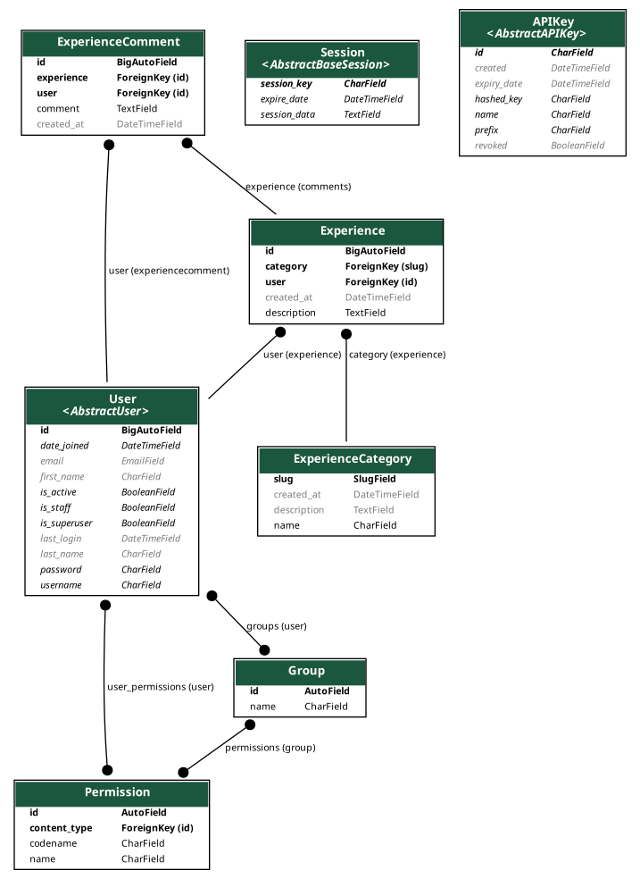

# Tajrobe Kon (Experience Sharing Platform)

Share your personal experiences and learn from others.

An overview of primary models:



## Install

1. Install [python 3.9](https://python.org). (preferred platform: Linux)
2. Install poetry:

```
curl -sSL https://install.python-poetry.org | python3 -
```

3. Install project dependencies:

```
poetry install
```

4. Install postgresql, create role and database.
5. Create .env file:

```
cp .example.env .env
```

6. Run migrate

```
./manage.py migrate
```

7. Run development server

```
./manage.py runserver
```

## Technical features

-   Django 3.2
-   Using [Poetry](https://github.com/python-poetry/poetry) for dependency management.
-   Get value insight and debug information while on Development with [django-debug-toolbar](https://django-debug-toolbar.readthedocs.org).
-   Collection of custom extensions with [django-extensions](http://django-extensions.readthedocs.org).
-   A simple still powerful caching system using [django-cachalot](https://django-cachalot.readthedocs.io/)
-   Graphql And RESTAPI endpoints using [graphene](https://docs.graphene-python.org/projects/django/en/latest/) and [Django REST framework](https://www.django-rest-framework.org/)

## Commands

Commands for development

### Make Messages (Generate Translation Files)

```
django-admin makemessages -l fa -e txt,py,html --no-location
```

### Compile Messages

```
django-admin compilemessages -l fa
```

### Generate Diagram

```
python manage.py graph_models -a -E -X AbstractUser,AbstractAPIKey,AbstractBaseSession,LogEntry,ContentType -o docs/images/experience.png
```
